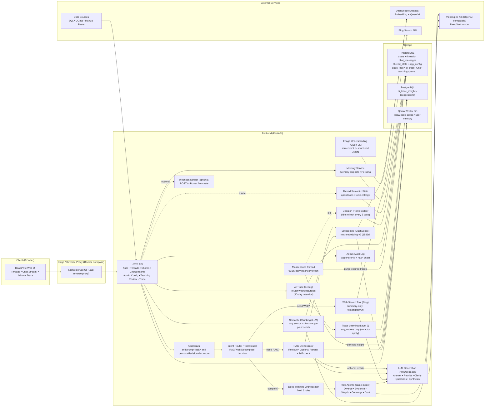

# TeamMember

TeamMember 是一个面向“团队成员协作 + 知识融合 + 记忆与画像”的自托管系统。

它解决以下核心问题：

1) 团队知识：把任何数据源（SQL / OData / 手工粘贴等）的内容，通过大模型按语义拆成“知识点”种子（seed），写入向量库，按需参与 RAG。  
2) 团队协作：每个成员独立账号登录；会话可共享并设置权限；系统会把对话自动提炼为“用户画像”和“长期记忆”，在每次对话中自动融合（同时尽量不拖慢响应）。
3) 语义状态：系统会异步维护线程级的“未闭合事项(open loops)”与“主题收敛程度(topic entropy)”，用于减少“这个/那个”这类指代歧义，并在必要时自动反问收敛问题。
4) 纠错回写：支持把对话中的纠错/沉淀提交为 Teaching，管理员审核通过后写入知识库；检索时会对 `source_kind=teaching` 做轻量加权（可配置）。
5) 管理审计：管理员对系统的关键变更（配置、权限、审核操作）会写入 append-only 审计日志。应用层不提供修改接口，数据库层也禁止对审计表做 UPDATE/DELETE（只允许 INSERT）。
6) 按需 Web Search：当路由器判断需要外部公开线索时，可调用 Bing Search API 获取“标题/摘要/URL”（不抓正文），并与 RAG 一起用于回答（可开关）。
7) 深度思考模式（固定 5 角色）：当路由器判断任务复杂度较高时，会进入“深度思考模式”，依次运行 5 个固定角色子 Agent（同一个模型），再由最终回答综合（可调“更少触发 / 更多触发 / 强制开关”）。
   - 5 角色：发散 / 检索&证据 / 反例&缺口&风险 / 问题收敛 / 用户沟通稿
   - 前端会显示实时状态（SSE meta），例如“已进入深度思考模式”“正在检索 RAG”“深度思考 3/5：反例/风险…”。
8) AI Trace（30 天）：每次对话可记录“路由决策 / Web Search 摘要 / 深度思考角色结果”等调试信息，普通用户可在 UI 查看（可开关，自动清理）。
9) AI Trace 学习建议：系统会基于近 7 天 Trace 的统计给出“参数建议”（例如子 Agent 偏好、Web Search query 上限等），仅展示，不会自动修改系统参数。

## 一键启动

前置：

- Docker Desktop（Windows）或 Docker Engine（Linux）
- API Key：
  - 火山方舟：`ARK_API_KEY`
  - 阿里 DashScope：`DASHSCOPE_API_KEY`（用于 embedding + 识图）

步骤：

1) 将 `.env.example` 复制为 `.env`，填入 `ARK_API_KEY` 和 `DASHSCOPE_API_KEY`  
2) 运行：`docker compose up -d --build`  
3) 打开：`http://localhost:8080`  

后端 Swagger：`http://localhost:8000/docs`

提示：管理员账号默认是“第一个注册的用户”。管理员在右上角可以打开 `Admin` 面板，配置全局参数、管理用户、审核 Teaching、配置数据源（SQL / OData / 手工粘贴）。

## Web Search（Bing，摘要模式）

用途：补充“外部公开线索/链接/最新信息”，仅使用 Bing 返回的 `title/snippet/url` 摘要，不抓取网页正文。

启用方式：

1) 在 `.env` 中填写 `BING_SEARCH_API_KEY`（没有 Key 时，即使 UI 勾选也不会实际搜索）  
2) 前端右上角 `Admin` 面板里勾选 `Web Search` 并保存  

相关运行时配置（Admin 面板）：

- `web_search_enabled`：是否允许按需 Web Search
- `web_search_top_k`：每个 query 返回的摘要条数（1~10）
- `web_search_max_queries`：每次最多发起的 query 数（1~5）

说明：

- Web Search 的结果可能过时/不完整：后端系统提示词已要求模型“不要被 Web 摘要绑架”，必须给出验证步骤或反问收敛。

## 深度思考模式（固定 5 角色）

用途：当问题涉及多个目标/多系统/多分支时，用固定 5 角色的方式并行/多视角分析，再综合输出，减少模型被单一证据绑架。

相关运行时配置（Admin 面板）：

- `agent_decompose_policy`：`auto | force_on | force_off`
- `agent_decompose_bias`：0..100（越高越倾向拆分）
- `agent_max_subtasks`：子任务上限（默认 5）

## AI Trace（普通用户可见，30 天自动清理）

用途：用于展示“系统到底调用了什么工具/怎么拆分”，便于 debug 和复盘。它不是安全审计（安全审计请看 Audit Log）。

查看方式：

- UI：对话中每条 AI 消息右上角会出现 `工具/Trace` 按钮（打开后可查看路由决策、Web 摘要、拆分与子 Agent 结果）。
- API：`GET /api/threads/{thread_id}/messages/{message_id}/trace`

保留策略：

- 默认保留 30 天；后端维护线程每天清理过期记录。
- 可通过 Admin 面板修改 `ai_trace_retention_days`。

## AI Trace 学习建议（仅建议，不自动生效）

用途：基于近 7 天的 AI Trace 统计给出“参数建议”，用于帮助管理员调优（例如：子 Agent 触发是否偏多/偏少，Web Search 是否应该启用/增减 query 上限）。

特性：

- 只展示建议，不会自动修改系统参数（不会写回 `app_config`）。
- 每天凌晨维护线程会尝试生成一次；管理员也可以在 Admin 面板里手动点“刷新建议”。

查看方式：

- 前端：`Admin` 面板的 “AI Trace 学习建议（Level 2）” 区域。
- API：`GET /api/admin/ai_trace/insights?limit=10`（仅管理员可访问；可加 `refresh=true` 立即生成一条）。

## 管理审计（Audit Log）

审计的目的：记录管理员对系统做过的关键变更，便于追溯与复盘。

特性：

- 只记录管理员变更（目前覆盖：`/admin/config`、`/admin/users/*`、Teaching 审核 approve/reject）。
- append-only：应用层无修改/删除接口；数据库触发器阻断对审计表的 UPDATE/DELETE。
- 哈希链：每条记录包含 `prev_hash` 与 `event_hash`，可用于发现“中间被篡改/被删”的痕迹。

查看方式：

- 前端：右上角 `Admin` 面板里有 “审计日志（只增不改）”。
- API：`GET /api/admin/audit?limit=200`（仅管理员可访问）。

边界说明：

- 该机制能防止“应用内管理员”篡改审计记录。
- 但如果有人拥有 Postgres 超级用户权限或能直接进容器执行 SQL，仍可能绕过数据库触发器。
  若需要更强的不可抵赖性，建议把每日的 `event_hash` 锚定到外部系统（Power Automate/Webhook、对象存储不可变策略等）。

## 被墙/网络问题处理（仍用 Docker）

如果你遇到类似 `failed to fetch anonymous token`（拉取基础镜像失败），优先用下面两种方式解决。

### 方式 A：配置 Docker 镜像加速（推荐）

在 Docker Desktop 的设置里配置 `registry-mirrors`（或你公司/自建的镜像仓库），让 `docker pull` 能稳定成功。

### 方式 B：在 `.env` 指定镜像源/基础镜像

本项目支持通过 `.env` 覆盖镜像与构建基础镜像：

- `POSTGRES_IMAGE`
- `QDRANT_IMAGE`
- `PYTHON_BASE_IMAGE`
- `NODE_BASE_IMAGE`
- `NGINX_BASE_IMAGE`

示例（仅示意，按你可用的镜像仓库替换）：

- `PYTHON_BASE_IMAGE=m.daocloud.io/library/python:3.11-slim`
- `NODE_BASE_IMAGE=m.daocloud.io/library/node:20-alpine`
- `NGINX_BASE_IMAGE=m.daocloud.io/library/nginx:1.27-alpine`

### 包管理镜像（可选）

如果 `pip/npm` 下载慢或失败，也可以在 `.env` 里设置：

- `PIP_INDEX_URL` / `PIP_TRUSTED_HOST`
- `NPM_REGISTRY`

## 架构图（Mermaid）

