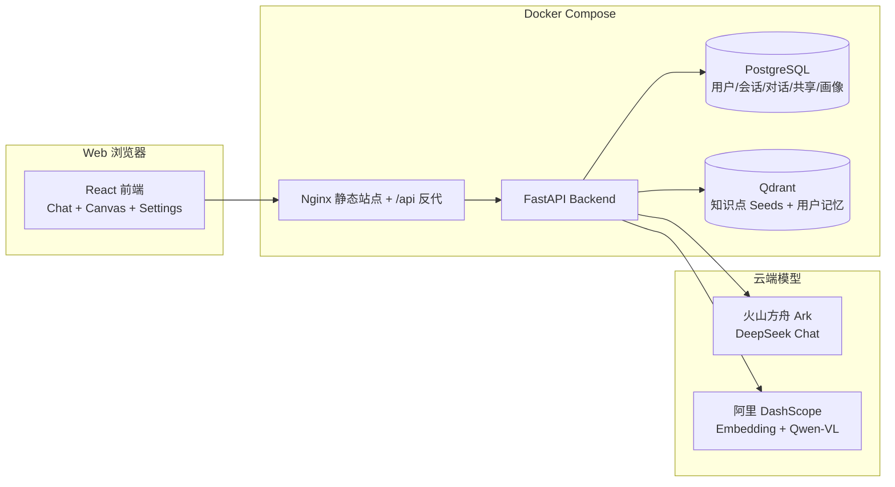

# TeamMember

TeamMember 是一个面向“团队成员协作 + 知识融合 + 记忆与画像”的自托管系统。

它解决两个核心问题：

1) 团队知识：把任何数据源（SQL / OData / 手工粘贴等）的内容，通过大模型按语义拆成“知识点”种子（seed），写入向量库，按需参与 RAG。  
2) 团队协作：每个成员独立账号登录；会话可共享并设置权限；系统会把对话自动提炼为“用户画像”和“长期记忆”，在每次对话中自动融合（同时尽量不拖慢响应）。
3) 语义状态：系统会异步维护线程级的“未闭合事项(open loops)”与“主题收敛程度(topic entropy)”，用于减少“这个/那个”这类指代歧义，并在必要时自动反问收敛问题。
4) 纠错回写：支持把对话中的纠错/沉淀提交为 Teaching，管理员审核通过后写入知识库；检索时会对 `source_kind=teaching` 做轻量加权（可配置）。

## 一键启动

前置：

- Docker Desktop（Windows）或 Docker Engine（Linux）
- API Key：
  - 火山方舟：`ARK_API_KEY`
  - 阿里 DashScope：`DASHSCOPE_API_KEY`（用于 embedding + 识图）

步骤：

1) 将 `.env.example` 复制为 `.env`，填入 `ARK_API_KEY` 和 `DASHSCOPE_API_KEY`  
2) 运行：`docker compose up -d --build`  
3) 打开：`http://localhost:8080`  

后端 Swagger：`http://localhost:8000/docs`

提示：管理员账号默认是“第一个注册的用户”。管理员在右上角可以打开 `Admin` 面板，配置全局参数、管理用户、审核 Teaching、配置数据源（SQL / OData / 手工粘贴）。

## 被墙/网络问题处理（仍用 Docker）

如果你遇到类似 `failed to fetch anonymous token`（拉取基础镜像失败），优先用下面两种方式解决。

### 方式 A：配置 Docker 镜像加速（推荐）

在 Docker Desktop 的设置里配置 `registry-mirrors`（或你公司/自建的镜像仓库），让 `docker pull` 能稳定成功。

### 方式 B：在 `.env` 指定镜像源/基础镜像

本项目支持通过 `.env` 覆盖镜像与构建基础镜像：

- `POSTGRES_IMAGE`
- `QDRANT_IMAGE`
- `PYTHON_BASE_IMAGE`
- `NODE_BASE_IMAGE`
- `NGINX_BASE_IMAGE`

示例（仅示意，按你可用的镜像仓库替换）：

- `PYTHON_BASE_IMAGE=m.daocloud.io/library/python:3.11-slim`
- `NODE_BASE_IMAGE=m.daocloud.io/library/node:20-alpine`
- `NGINX_BASE_IMAGE=m.daocloud.io/library/nginx:1.27-alpine`

### 包管理镜像（可选）

如果 `pip/npm` 下载慢或失败，也可以在 `.env` 里设置：

- `PIP_INDEX_URL` / `PIP_TRUSTED_HOST`
- `NPM_REGISTRY`

## 架构图（Mermaid）

